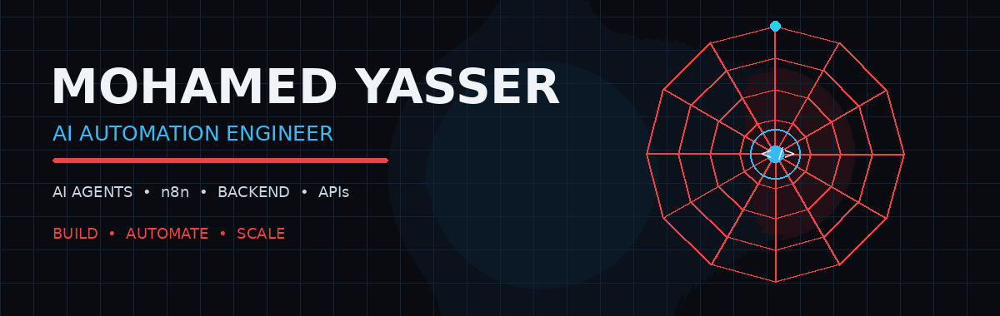

<div align="center">



<br/>


<br/><br/>

<a href="https://mohamed-yasser-portfolio.vercel.app/">

</a>
<a href="https://www.linkedin.com/in/mohamed-yasser-gaber2005/">

</a>

</div>

---

# 🕷️ `HELLO, I'M MOHAMED YASSER`

### `MOHAME-D-69`

**Software Engineer · AI Automation · AI Agents · Backend Development**

> 🕸️ I build the systems behind the scenes — connecting AI, APIs, data, and business workflows so repetitive work can run itself.

---

# 🕸️ THE WEB I BUILD

```text
                         🕷️
                         │
              ┌──────────┼──────────┐
              │          │          │
             AI         APIs       DATA
              │          │          │
              └──────────┼──────────┘
                         │
                  ┌──────▼──────┐
                  │  AI AGENT   │
                  │ Understand  │
                  │ Decide      │
                  │ Act         │
                  └──────┬──────┘
                         │
                  ┌──────▼──────┐
                  │    n8n      │
                  │ AUTOMATION  │
                  └──────┬──────┘
                         │
          ┌──────────────┼──────────────┐
          ▼              ▼              ▼
         CRM           EMAIL         DATABASE
          │              │              │
          └──────────────┼──────────────┘
                         ▼
                    📈 RESULT
```

**The mission:**  
`Less manual work → smarter systems → better business operations.`

---

# 🧠 WHAT'S IN MY WEB?

| 🕷️ Area | ⚡ What I Build |
|---|---|
| 🤖 **AI Automation** | AI Agents, LLM workflows, intelligent routing |
| ⚙️ **n8n Engineering** | Webhooks, workflows, triggers, multi-step automation |
| 🧠 **AI Systems** | RAG, vector search, memory, tool calling, MCP |
| 💻 **Backend** | Node.js, Express, TypeScript, JavaScript, Python |
| 🗄️ **Data** | MongoDB, Mongoose, PostgreSQL, Supabase, SQL |
| 🔌 **Integrations** | REST APIs, Telegram, WhatsApp, Shopify, Google services |

---

# 🔥 PROJECTS IN THE WEB

### 🕷️ EDITH V3
**AI Personal Assistant & Automation System**

`Natural Language → AI → Tools → Automated Actions`

Built around intelligent workflows, integrations, and agent-based automation.

---

### 🏥 AI CLINIC AUTOMATION

```text
Patient Request
      ↓
   AI Understanding
      ↓
Service / Availability
      ↓
 Appointment Booking
      ↓
    Database
      ↓
  Confirmation
```

An AI-powered workflow for automating clinic and appointment operations.

---

### 💼 AI SALES AGENT

**Telegram → AI Sales Agent → CRM → Order → Follow-up**

- 🧠 AI sales conversations
- 📦 Product discovery
- 🛒 Order collection
- 💳 Payment handling
- 📊 CRM integration
- 👨‍💼 Human escalation
- 🔄 Follow-up automation

---

### 🧑‍💼 AI CV SCREENING

```text
CV
 ↓
PDF Extraction
 ↓
AI Screening
 ↓
Candidate Score
 ↓
Decision
 ↓
Sheets / Database
 ↓
Notification
```

Automated recruitment pipeline for screening and evaluating candidates.

---

### 🍽️ AI RESTAURANT ASSISTANT

```text
                 Customer
                    │
                    ▼
             Intent Classifier
              ↙      ↓      ↘
          Orders   Questions  General
              ↘      ↓      ↙
                  AI Agent
                 ↙       ↘
           Order Tools    RAG
                 ↘       ↙
                  Response
```

AI assistant combining intent routing, conversation memory, order tools, and RAG.

---

### 🛒 SHOPIFY AI AUTOMATION

`WhatsApp / Voice → AI Store Manager → Shopify → Orders / Products / Email`

AI-powered e-commerce operations and store management.

---

# 🧩 MY ENGINEERING DNA

I don't start by asking:

> **"Which technology should I use?"**

I start here:

```text
       🕷️ BUSINESS PROBLEM
                ↓
        Find manual work
                ↓
        Design the workflow
                ↓
       Where does AI help?
                ↓
     Connect APIs + Tools + Data
                ↓
            AUTOMATE
                ↓
          TEST + IMPROVE
                ↓
        📈 BUSINESS RESULT
```

---

# 🛠️ MY TOOL BELT

<div align="center">

### 🤖 AI & AUTOMATION

`n8n` · `AI Agents` · `OpenAI` · `OpenRouter` · `RAG` · `MCP`

### 💻 BACKEND

`Node.js` · `Express.js` · `TypeScript` · `JavaScript` · `Python`

### 🗄️ DATABASES

`MongoDB` · `Mongoose` · `PostgreSQL` · `Supabase` · `SQL`

### 🔌 INTEGRATIONS

`REST APIs` · `Webhooks` · `Telegram` · `WhatsApp` · `Shopify`

### 🚀 DEVOPS & TOOLS

`Git` · `GitHub` · `Docker` · `Vercel`

</div>

---

# 📊 GITHUB SIGNAL

<div align="center">


<br/>


</div>

---

# 🧠 CURRENTLY EVOLVING

```text
AI Agents
   +
MCP
   +
RAG
   +
Tool Calling
   +
Business Automation
   +
Backend Systems
        ↓
   Intelligent
     Systems
```

---

# 🌐 CONNECT

<div align="center">

### 🚀 Portfolio

**https://mohamed-yasser-portfolio.vercel.app/**

### 💼 LinkedIn

**https://www.linkedin.com/in/mohamed-yasser-gaber2005/**

</div>

---

<div align="center">

## 🕷️ `WITH GREAT AUTOMATION COMES GREAT SCALE.`

### `BUILD  •  AUTOMATE  •  SCALE`

**Made with ☕ + 🤖 + n8n**

</div>
